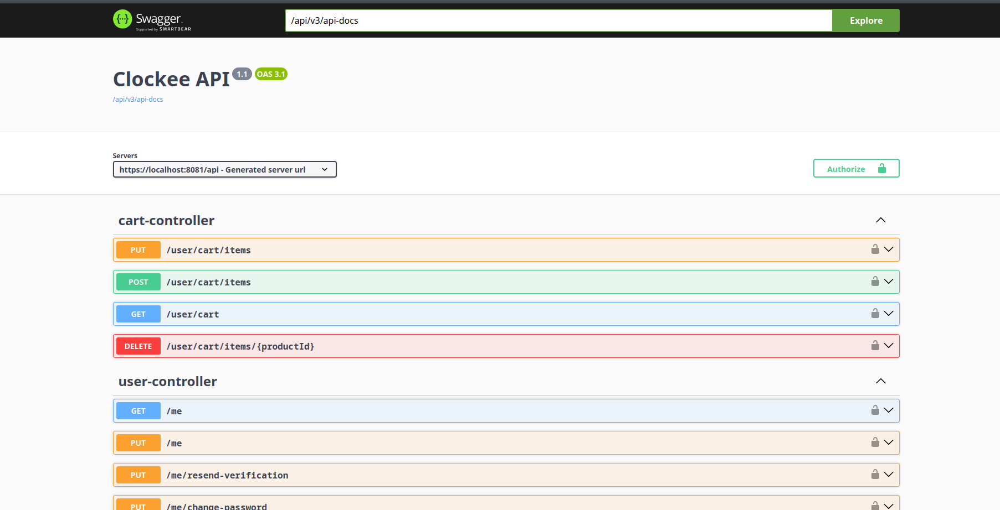
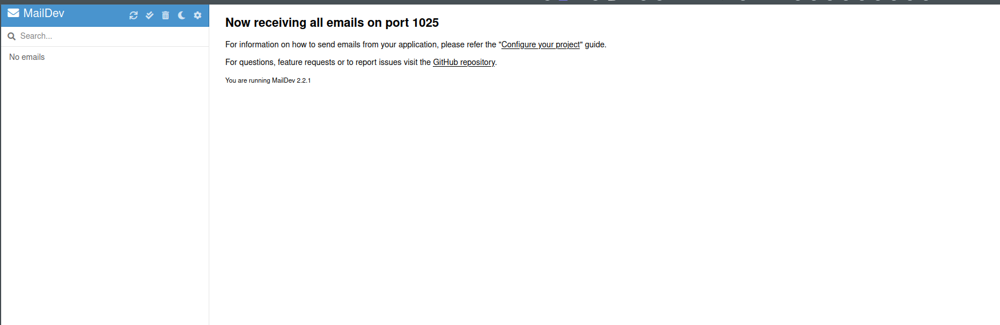
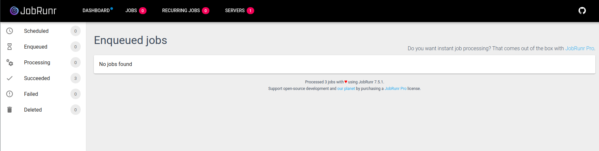

Clocke is a pet project for pratice building simple ecommerce system in java 
# Technologies and frameworks
- Java 17 
- Spring Boot 3.5
- Next.js 15
- Github actions 
- Test containers 
- MSSQL 2022


# Getting started
**Prerequisites**
- Docker and Docker Compose 
- GNU Make 

## Docker compose 
Services
``` 
:80 Nginx
:1080 Maildev 
:1434 MSSQL Server 
:6327 Redis 
:8080 Spring Boot http
:8081 Spring Boot https
:3000 Next.js
```

There are 2 way to run this project: 
1. Run pre-built docker image.
In root entry `clockee/` run 
``` 
make build 
```
You all set!

2. Run application in local source code 

Setup docker and docker compose then run to start mssql and mail server service and utility services. 
```
docker compose up -d 
```
No docker? make sure you have mssql with database `clockeedb` with password for `sa` is `example_123` and use `make run` instead.

Running Clockee server Spring Boot
```
cd clockee-server 
make build
```

Running Clockee client Next.js with npm 
``` 
cd clockee-ui
npm install 
npm run dev 
```

## For explore 
This project is currently in progress. [Video walkthrough](https://www.youtube.com/watch?v=4C7IJjjg0o0&list=PL6XbmwursK7Zlu8Vv41GYQTuETwrh30zr&index=1)

Seed account for test environment 
- User: `user@clockee.com`/`clockee123`
- Product admin: `admin@clockee.com`/`clockee123`
- Inventory manager: `inventory@clockee.com`/`clockee123`
- Sys admin: `sys@clockee.com`/`clockee123`

[API document](https://localhost:8081/api/swagger-ui/index.html#/)

[Maildev](http://localhost:1080/#/)

[JobRunr](http://localhost:8000/dashboard/jobs)


# Screenshots 
  <table>
      <tbody>
          <tr>
              <td>
                  
                  
                  
                  
                  
                  
                  
                  
              </td>
              <td>
                  
                  
                  
                  
                  
                  
                  
                  
              </td>
          </tr>
      </tbody>
  </table>


# License
Licensed under the MIT License
